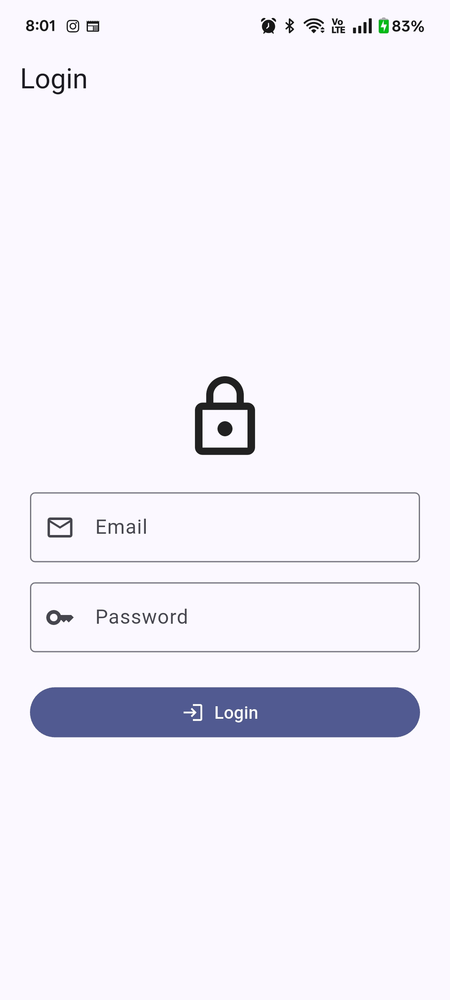
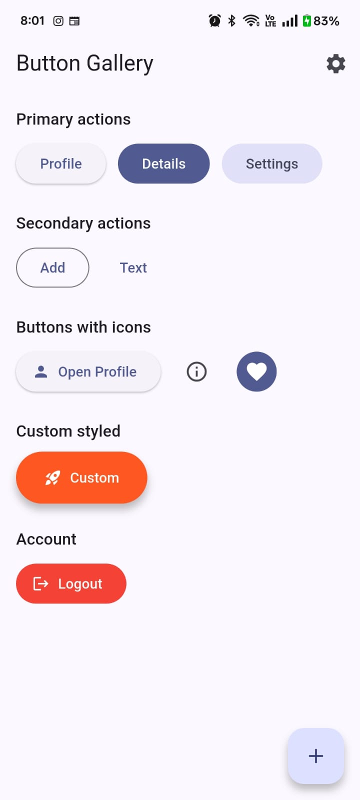
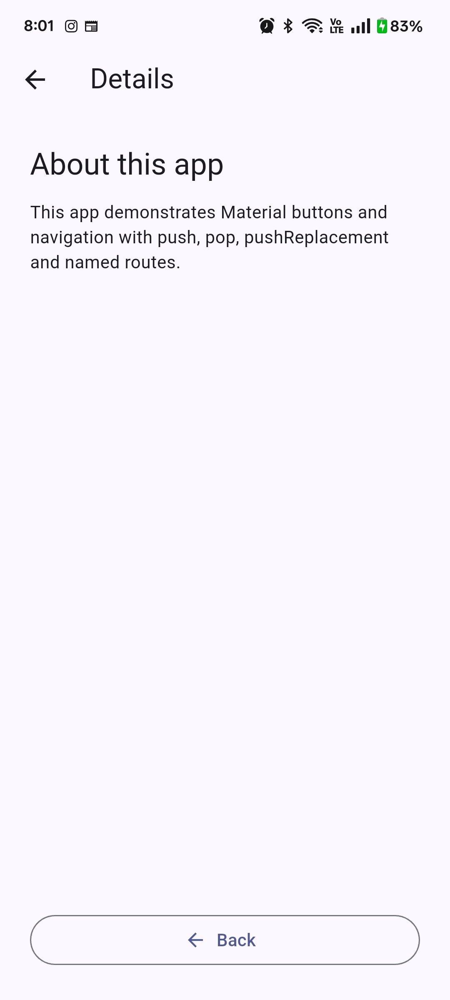

# FoodMap

## Short Description

FoodMap is a mobile application that helps users discover nearby street food vendors and explore their menus, prices, availability, and reviews. The app is designed to make finding local street food easier and more convenient.

## Features

* Discover nearby street food vendors
* View vendor profiles and food menus
* View food prices and information
* Check vendor availability
* Search for food vendors
* View customer reviews and ratings
* Follow favorite vendors
* Simple and user-friendly interface

## Screenshots

Screenshots of the application will be added here as development progresses.

## Technologies Used

* **Flutter** – Mobile application framework
* **Dart** – Programming language
* **SQLite** – Local database
* **Android Studio** – Development environment

## How to Run the Project

### Prerequisites

Make sure you have the following installed:

* Flutter SDK
* Dart SDK
* Android Studio
* An Android emulator or physical Android device
